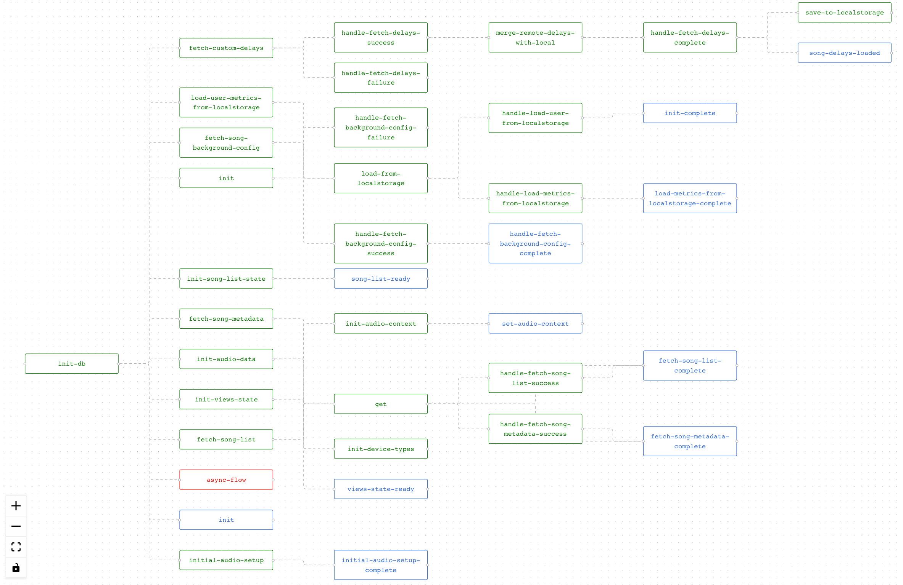

# Re-frame Flow

**re-frame-flow** is a graph based visualization tool for re-frame event chains. Let's assume we clicked a login button and triggered a series of events. `login-fx -> http-fx -> some-fx -> some-db-handler ...` (event after event), so a path gets generated, re-frame-flow visualizes all paths in a graph.




## Installation
[](https://clojars.org/org.clojars.ertucetin/re-frame-flow)


- Add re-frame-flow to **dev** dependencies:
```clojure
:profiles
   {:dev
      {:dependencies [[org.clojars.ertucetin/re-frame-flow "X.Y.Z"]] }}
```

- Add `re-frame-flow.preload` to **preloads**:
```clojure
{...
 :preloads [re-frame-flow.preload]
 ...}
```

- Update **^:dev/after-load** (if you're not using hot-reload, you can ignore this part):
```clojure
(ns my-app.core
  (:require [re-frame-flow.core :as re-flow]))

(defn ^:dev/after-load mount-root []
  (re-flow/clear-cache!)
  ...)
```

## Usage
- Make sure you have followed all of the installation instructions above.
- Start up your application.
- Once it is loaded, trigger some events (Flow panel gets updated when an event is triggered).
- Focus the document window and press **ctrl-g** to open the flow panel.

## Dispatch tracking (Optional)
If you want to track flow of `dispatch` and `dispatch-sync`, you need to use re-frame-flow's custom `dispatch` and `dispatch-sync`. ClojureScript does not provide `*ns*` at runtime, so these functions implemented as custom **macros**. Which means you can't pass like they are functions.

- You need to move `re-frame-flow` dependency dev to **prod**
- Update your **dev** `closure-defines` inside **shadow-cljs.edn**
    - ```clojure
        :dev
         {:compiler-options
          {:closure-defines
           {re-frame-flow.macros.dispatch-enabled? true}}}
      ```
- Update your views (or any namespace that uses `dispatch`)
    - ```clojure
      (ns app.views
       (:require [re-frame-flow.macros :refer-macros [dispatch dispatch-sync]]
        ...))
      ```

## Live Demo

- [Re-frame Flow Demo](https://ertugrulcetin.github.io/re-frame-flow-demo/index.html)

## Running the example
- `git clone git@github.com:ertugrulcetin/re-frame-flow.git`
- `npm install`
- `lein watch`
- Open http://localhost:8280
- Click `Trigger 1` button
- Press `ctrl-g` (opens the panel)
- Pres it again (closes the panel)
- Click `Trigger 2` button
- Open the panel again (you will notice new events)
