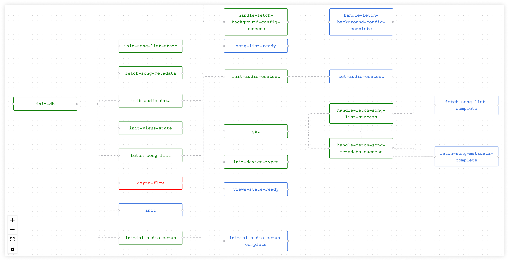

# Re-frame Flow

**re-frame-flow** is a graph based visualization tool for Re-frame event chains.




## Usage

- Add **re-frame-flow** to dev dependencies:
```clojure
:profiles
   {:dev
      {:dependencies [[re-frame-flow "X.Y.Z"]] }}
```

- Add to **preloads**:
```clojure
{...
 :preloads [re-frame-flow.preload]
 ...}
```

- Update **^:dev/after-load**:
```clojure
(ns my-app.core
  (:require [re-frame-flow.core :as re-flow]))

(defn ^:dev/after-load mount-root []
  (re-flow/clear-cache!)
  ...)
```
